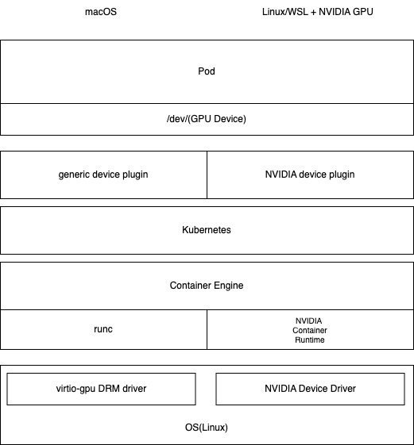

# GPUハンズオン・ハッカソン

このドキュメントはGPUハンズオン・ハッカソンのための資料です。

1. Mac(Apple Silliconで参加)
  * k8sでGPUを利用することができます。下記のURLをご覧になり進めてください。
  * https://github.com/okamototk/k8s-mac
2. Windows Intel Core i7 11thより新しいプロセッサ
  * k8sでの動作方法は確立されていません。Ollamaを動作させる時にGPUを利用することができます。
  * 下記のドキュメントを参考に、ipex-llm版のOllamaをご利用ください。
    * [Run Ollama with IPEX-LLM on Intel GPU](https://github.com/intel/ipex-llm/blob/main/docs/mddocs/Quickstart/ollama_quickstart.md)
3. Windows + GeForce
  * Ollamaは普通に使うことができます。1
  * k8sで利用する場合は、下記の環境が必要となります。
    * WSL2
    * WSL CUDA Driver: https://developer.nvidia.com/cuda/wsl
    上記をインストールした上でk8s, [NVIDIA Device Driver](https://github.com/NVIDIA/k8s-device-plugin)プラグインなどを利用すると動作する可能性があります。
4. Linux + GeForce
  * Ollamaは普通に使うことができます。
  * k8sで利用する場合、NVIDIA Driver、NVIDIA Container Runtimeを手動でインストールしてGPU Operatorをインストールすれば、動作するかもしれません。

## 補足解説
インストール上の構成や注意などの補足解説。

### Kubernetesに関わるアーキテクチャ

### macOS
* MacのネイティブGPU APIはMetal APIなので、MoltenVKでホスト側でVulkan APIに変換する。
* コンテナが動作するVM上では、/dev/driとしてGPUデバイスが公開される
* generic device pluginを利用して、apple.com/gpuリソースに対して、/dev/driをアタッチし、GPUを利用できるようにする。
* GPUはvulkan driverにより利用することができる。

ホスト含めた詳細なアーキテクチャは、[こちらの図を参照](https://github.com/okamototk/k8s-mac/blob/main/docs/mac-k8s-architecture.png)のこと。

### Linux + NVIDIA
* DC向けGPUの場合1(H100,H200など)、GPU OperatorがDevice Driver、NVIDIA Container Runtime‚NVIDIA Device PluginなどGPUに必要なコンポーネントをすべてインストールしてくれる。また、ノードラベルなども自動で設定してくれる。
* DC向けでない場合、手動で幾つか設定した上でGPU Operatorをインストールする必要がある
 * 手動: Device Driver、NVIDIA Container Runtime
 * 自動：NVIDIA Device Plugin, ノードラベルの追加
* WSLの場合、おそらくDC向けでない方法と同等の手順でセットアップすることができると思われるが、下記のサイトを参考にして、WSL版のLinuxドライバが必要となる。また、現在のところRancherでは動作しない。
  * [CUDA on WSL User Guide](https://docs.nvidia.com/cuda/wsl-user-guide/index.html) 
